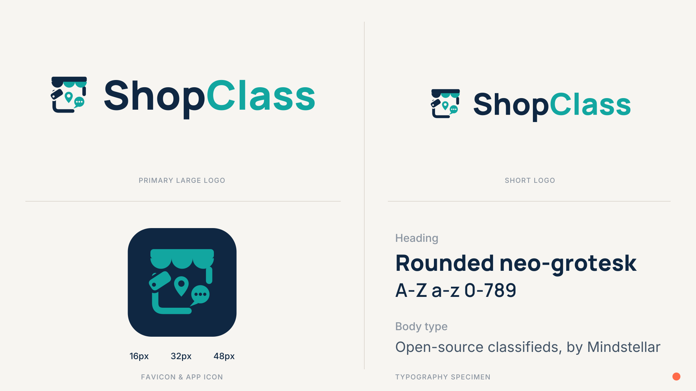

# ShopClass Brand

Brand identity assets for **ShopClass**, open-source classifieds by
[Mindstellar](https://github.com/mindstellar).

## Contents

- [`brand/`](brand): logos (color + all-navy monochrome), standalone mark,
  favicon set with web manifest, and the brand-guidelines board. All pure SVG
  with text converted to outlines; see [`brand/README.md`](brand/README.md)
  for the full file list, palette, and usage snippets.
- [`tools/`](tools): Python scripts that generate the SVGs, so assets can be
  rebuilt or tweaked from source.

## Palette

| | Color | Hex |
|---|---|---|
|  | Deep Navy | `#0F2742` |
|  | Teal | `#12A6A0` |
|  | Warm Off-White | `#F7F5F1` |
|  | Slate Gray | `#435466` |
|  | Coral (accent) | `#FF6B4A` |

## License

- **Brand assets** (`brand/`):
  [CC BY-ND 4.0](brand/LICENSE): share and use with attribution; please don't
  modify the logos or create derivative marks. The "ShopClass" name and logo
  identify the ShopClass project and shouldn't be used to imply endorsement.
- **Build tooling** (`tools/`): [MIT](tools/LICENSE).
- Typography outlines embedded in the SVGs derive from
  [Manrope](https://github.com/sharanda/manrope) and
  [Inter](https://github.com/rsms/inter), both licensed under the
  [SIL Open Font License 1.1](https://openfontlicense.org/).
